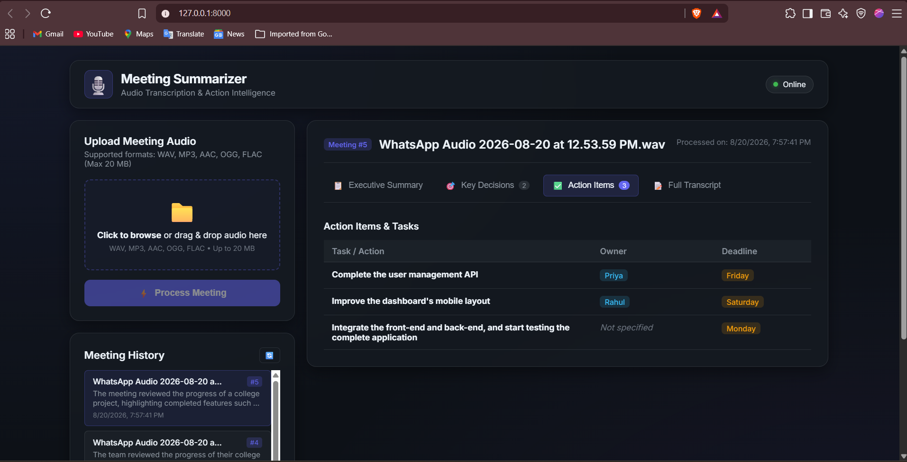
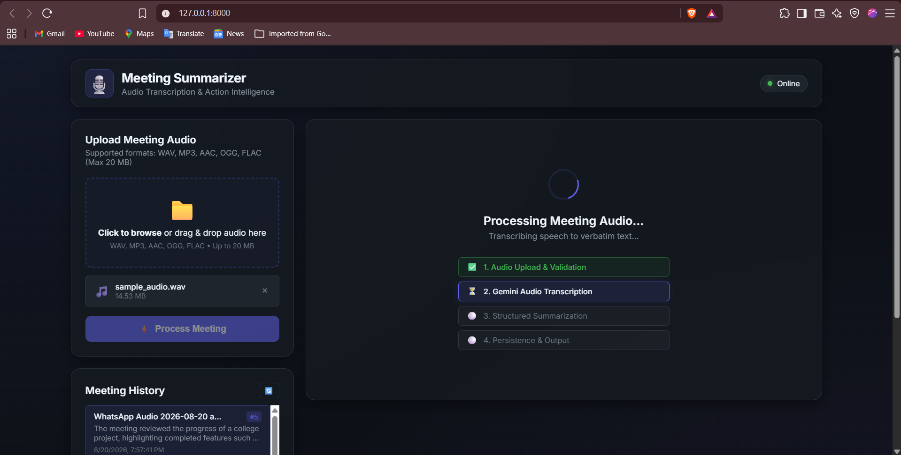
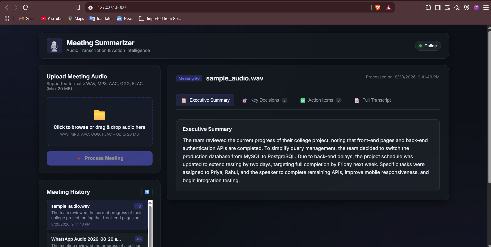
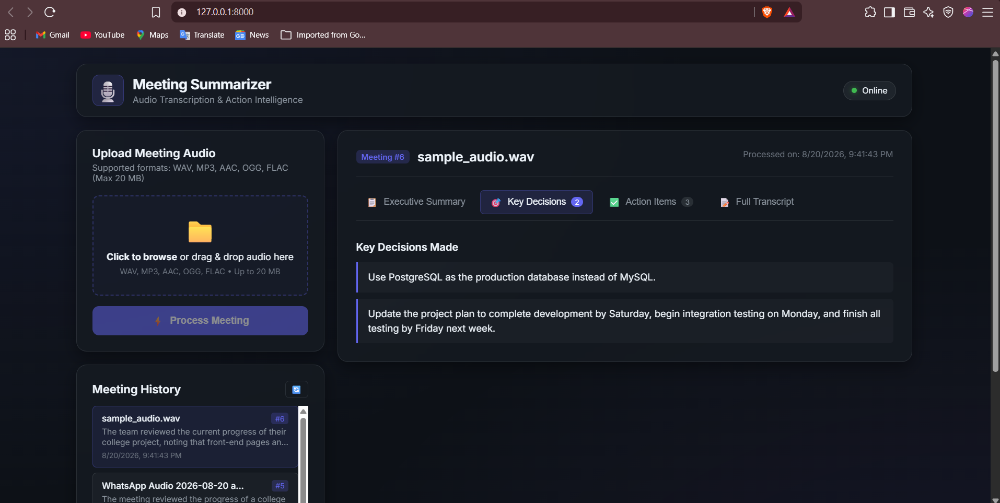
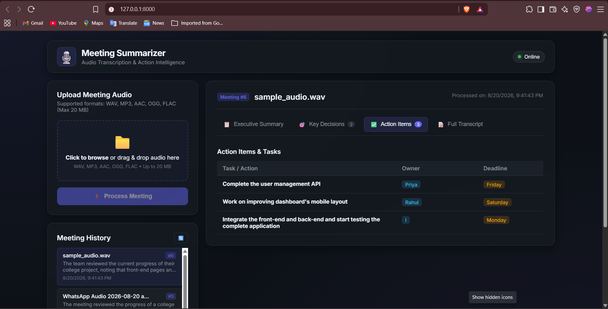
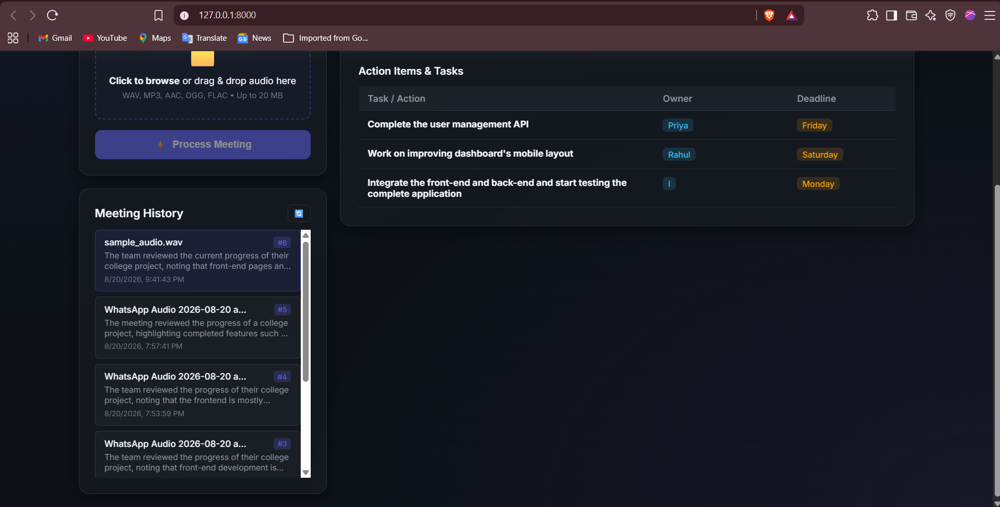
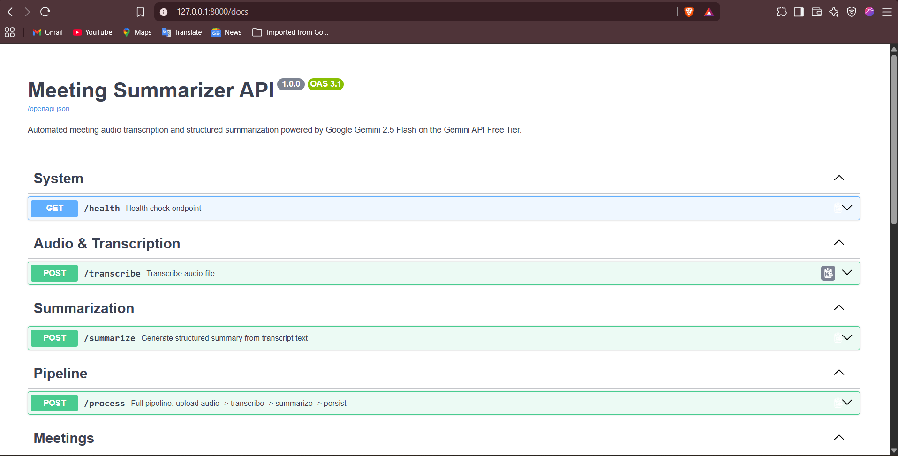
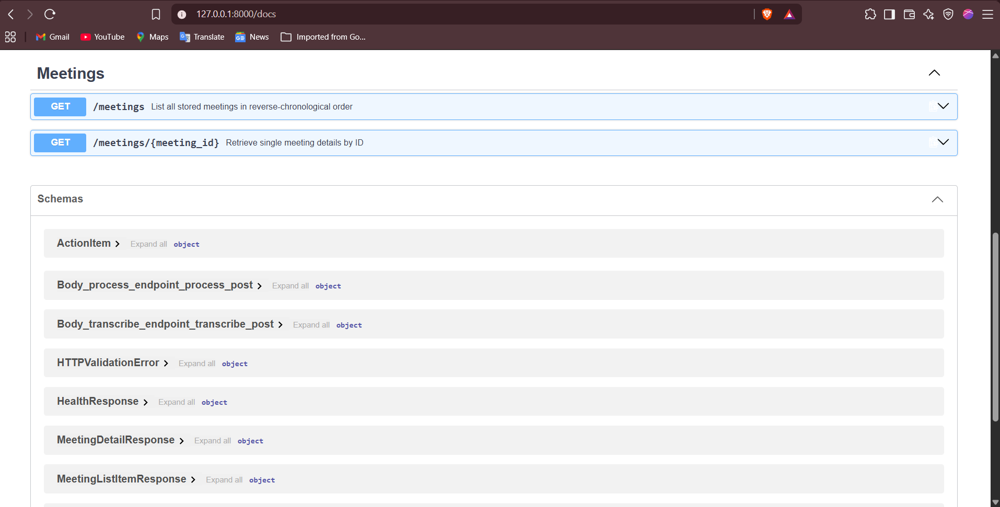
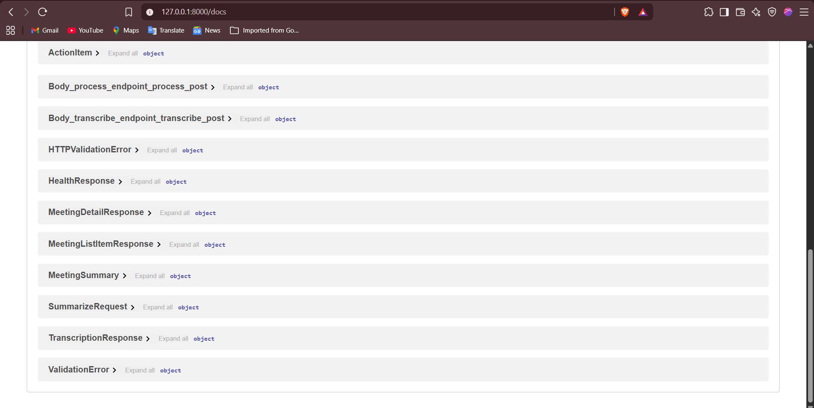

# Meeting Summarizer

An automated meeting processing application designed to transcribe meeting audio and generate structured, action-oriented summaries using Google Gemini models on the Gemini API Free Tier.

## Project Description

Meeting Summarizer is designed to ingest recorded meeting audio files, generate text transcripts, extract key decisions, and produce actionable task lists with explicit owners and deadlines. It is built with a Python FastAPI backend, local SQLite persistence, and a vanilla HTML/CSS/JavaScript web interface.

## Tech Stack

- **Backend Framework:** FastAPI (Python)
- **AI / Multimodal LLM:** Google Gemini Developer API (`gemini-3.6-flash` via official `google-genai` SDK)
- **Database:** SQLite (Python standard library `sqlite3`)
- **Frontend:** Vanilla HTML5, CSS3, JavaScript (no external frameworks or build tooling)
- **Server:** Uvicorn ASGI

## Architecture Overview

```
meeting_summarizer/
├── backend/
│   ├── config.py            # Centralized environment configuration (Implemented)
│   ├── gemini_client.py     # Gemini client & service wrapper (Implemented)
│   ├── main.py              # FastAPI application & route endpoints (Implemented)
│   ├── transcriber.py       # Audio transcription via Gemini Files API (Implemented)
│   ├── summarizer.py        # Structured summarization via Gemini API (Implemented)
│   ├── database.py          # SQLite database connection & CRUD (Implemented)
│   ├── models.py            # Pydantic schemas & response validation (Implemented)
│   └── requirements.txt     # Minimal backend dependencies (Implemented)
├── frontend/
│   ├── index.html           # Single-page user interface (Implemented)
│   ├── style.css            # Custom responsive styles (Implemented)
│   └── app.js               # Client-side API interactions & UI logic (Implemented)
├── demo_video/
│   └── meeting-summarizer-demo.mp4  # Walkthrough demonstration video
├── sample_audio/
│   └── sample_meeting.wav   # Sample meeting audio recording for testing
├── screenshots/             # Application UI and API documentation screenshots (9 images)
├── .env.example             # Environment configuration template (Implemented)
├── .gitignore               # Strict repository exclusion rules (Implemented)
└── README.md                # Project documentation (Implemented)
```

## Implementation Status

- **Phase 1: Project Foundation** — Completed. Clean directory structure, dependencies, and repository hygiene configuration.
- **Phase 2: Gemini API Foundation** — Completed. Centralized configuration (`config.py`) and reusable Gemini service layer (`gemini_client.py`) using the official `google-genai` SDK with comprehensive error handling.
- **Phase 3: Database & Models** — Completed. Data schemas (`models.py`) and local SQLite persistence layer with full CRUD operations (`database.py`).
- **Phase 4: Audio Transcription** — Completed. Gemini Files API audio upload, validation (size <= 20 MB, formats `.wav`, `.mp3`, `.aac`, `.ogg`, `.flac`), verbatim transcription via `gemini-3.6-flash`, and automatic file reference cleanup (`transcriber.py`).
- **Phase 5: Structured Summarization** — Completed. Gemini 3.6 Flash structured meeting summarization enforcing `MeetingSummary` Pydantic response schema, anti-hallucination rules, and "Not specified" fallbacks (`summarizer.py`).
- **Phase 6: FastAPI Processing Pipeline** — Completed. Integrated processing endpoints (`GET /health`, `POST /transcribe`, `POST /summarize`, `POST /process`, `GET /meetings`, `GET /meetings/{id}`) with comprehensive HTTP validation and error handling (`main.py`).
- **Phase 7: Frontend UI & History** — Completed. Responsive vanilla HTML5/CSS3/JavaScript interface supporting drag-and-drop audio uploads, tabbed result navigation, loading state progression, and interactive meeting history (`index.html`, `style.css`, `app.js`).

## Processing Pipeline

1. **Upload:** User provides a meeting audio recording (`.wav`, `.mp3`, `.aac`, `.ogg`, `.flac` up to 20 MB).
2. **Transcription:** Audio is sent to the Gemini API using `gemini-3.6-flash` to generate a verbatim transcript.
3. **Summarization:** The transcript is analyzed by `gemini-3.6-flash` with a strict JSON schema (`response_schema`) extracting:
   - Executive meeting summary
   - Key decisions made
   - Action items (task, owner, deadline)
4. **Persistence:** The transcript and structured summary are saved in a local SQLite database.
5. **Display:** The results and meeting history are presented in the web UI.

## Running the Application

### Prerequisites

- Python 3.10+ installed
- Google Gemini API key (from [Google AI Studio](https://aistudio.google.com/apikey))

### 1. Install Dependencies

```bash
pip install -r backend/requirements.txt
```

### 2. Configure Environment

Copy `.env.example` to `.env` and set your API key:

```bash
cp .env.example .env
```

```env
GEMINI_API_KEY=your_actual_api_key_here
GEMINI_MODEL=gemini-3.6-flash
MAX_AUDIO_SIZE_MB=20
```

### 3. Start the Server

```bash
uvicorn backend.main:app --reload
```

### 4. Open the Web Interface

Open your browser and navigate to [http://localhost:8000](http://localhost:8000).

The interactive API documentation is also accessible at [http://localhost:8000/docs](http://localhost:8000/docs).

## Demo

The project is structured to demonstrate an end-to-end meeting analysis walkthrough:
- **Audio Upload:** Selecting and dragging-and-dropping meeting audio files (`.wav`, `.mp3`, `.aac`, `.ogg`, `.flac` up to 20 MB).
- **Verbatim Transcription:** Speech-to-text processing via Gemini 3.6 Flash.
- **Executive Summary:** Concise meeting overview synthesis.
- **Key Decisions:** Extraction of concrete conclusions and agreements.
- **Action Items:** Itemized table of tasks with assigned owners and deadlines (with `"Not specified"` fallback for unmentioned values).
- **Full Transcript:** Complete verbatim text with one-click clipboard copying.
- **Meeting History:** Instant browsing and reloading of previous meeting summaries from SQLite persistence.

### Demo Video

A short walkthrough demonstrating the complete Meeting Summarizer workflow, including audio upload, transcription, structured summarization, action-item extraction, full transcript viewing, and meeting history persistence.

[Watch the Demo Video](demo_video/meeting-summarizer-demo.mp4)

## Screenshots

The following screenshots demonstrate the application's main workflow, generated results, meeting history, and API endpoints.



















## Configuration & Gemini API Setup

The application is designed to operate with the Google Gemini Developer API on the **Gemini API Free Tier**.

1. **Obtain API Key:** Get a free API key at [Google AI Studio](https://aistudio.google.com/apikey). Ensure billing is disabled on the associated Google Cloud project to remain strictly on the Free Tier.
2. **Configure Environment:** Create a `.env` file from `.env.example` as shown above.

> **Security Note:** Never commit `.env` or real API keys to version control. The repository `.gitignore` ensures that `.env` and local database files remain strictly local.
